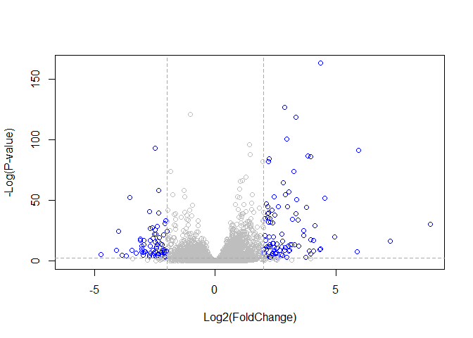

class14: Transcriptomics and the analysis of RNA-Seq data
================
Han Duong
June 6, 2019

Install bioconductor and deseq2

``` r
library(BiocManager)
library(DESeq2)
```

    ## Loading required package: S4Vectors

    ## Loading required package: stats4

    ## Loading required package: BiocGenerics

    ## Loading required package: parallel

    ## 
    ## Attaching package: 'BiocGenerics'

    ## The following objects are masked from 'package:parallel':
    ## 
    ##     clusterApply, clusterApplyLB, clusterCall, clusterEvalQ,
    ##     clusterExport, clusterMap, parApply, parCapply, parLapply,
    ##     parLapplyLB, parRapply, parSapply, parSapplyLB

    ## The following objects are masked from 'package:stats':
    ## 
    ##     IQR, mad, sd, var, xtabs

    ## The following objects are masked from 'package:base':
    ## 
    ##     anyDuplicated, append, as.data.frame, basename, cbind,
    ##     colnames, dirname, do.call, duplicated, eval, evalq, Filter,
    ##     Find, get, grep, grepl, intersect, is.unsorted, lapply, Map,
    ##     mapply, match, mget, order, paste, pmax, pmax.int, pmin,
    ##     pmin.int, Position, rank, rbind, Reduce, rownames, sapply,
    ##     setdiff, sort, table, tapply, union, unique, unsplit, which,
    ##     which.max, which.min

    ## 
    ## Attaching package: 'S4Vectors'

    ## The following object is masked from 'package:base':
    ## 
    ##     expand.grid

    ## Loading required package: IRanges

    ## 
    ## Attaching package: 'IRanges'

    ## The following object is masked from 'package:grDevices':
    ## 
    ##     windows

    ## Loading required package: GenomicRanges

    ## Loading required package: GenomeInfoDb

    ## Loading required package: SummarizedExperiment

    ## Loading required package: Biobase

    ## Welcome to Bioconductor
    ## 
    ##     Vignettes contain introductory material; view with
    ##     'browseVignettes()'. To cite Bioconductor, see
    ##     'citation("Biobase")', and for packages 'citation("pkgname")'.

    ## Loading required package: DelayedArray

    ## Loading required package: matrixStats

    ## 
    ## Attaching package: 'matrixStats'

    ## The following objects are masked from 'package:Biobase':
    ## 
    ##     anyMissing, rowMedians

    ## Loading required package: BiocParallel

    ## 
    ## Attaching package: 'DelayedArray'

    ## The following objects are masked from 'package:matrixStats':
    ## 
    ##     colMaxs, colMins, colRanges, rowMaxs, rowMins, rowRanges

    ## The following objects are masked from 'package:base':
    ## 
    ##     aperm, apply, rowsum

    ## Registered S3 methods overwritten by 'ggplot2':
    ##   method         from 
    ##   [.quosures     rlang
    ##   c.quosures     rlang
    ##   print.quosures rlang

Import countData and colData

``` r
counts <- read.csv("airway_scaledcounts.csv", stringsAsFactors = FALSE)
metadata <-  read.csv("airway_metadata.csv", stringsAsFactors = FALSE)
```

Take a look

``` r
head(counts)
```

    ##           ensgene SRR1039508 SRR1039509 SRR1039512 SRR1039513 SRR1039516
    ## 1 ENSG00000000003        723        486        904        445       1170
    ## 2 ENSG00000000005          0          0          0          0          0
    ## 3 ENSG00000000419        467        523        616        371        582
    ## 4 ENSG00000000457        347        258        364        237        318
    ## 5 ENSG00000000460         96         81         73         66        118
    ## 6 ENSG00000000938          0          0          1          0          2
    ##   SRR1039517 SRR1039520 SRR1039521
    ## 1       1097        806        604
    ## 2          0          0          0
    ## 3        781        417        509
    ## 4        447        330        324
    ## 5         94        102         74
    ## 6          0          0          0

``` r
head(metadata)
```

    ##           id     dex celltype     geo_id
    ## 1 SRR1039508 control   N61311 GSM1275862
    ## 2 SRR1039509 treated   N61311 GSM1275863
    ## 3 SRR1039512 control  N052611 GSM1275866
    ## 4 SRR1039513 treated  N052611 GSM1275867
    ## 5 SRR1039516 control  N080611 GSM1275870
    ## 6 SRR1039517 treated  N080611 GSM1275871

Exploratory differential gene expression

``` r
control <- metadata[metadata[,"dex"]=="control",]
control.mean <- rowSums( counts[ ,control$id] )/4 
names(control.mean) <- counts$ensgene

treated <- metadata[metadata[,"dex"]=="treated",]
treated.mean <- rowSums(counts[,treated$id])/4
names(treated.mean) <- counts$ensgene
```

``` r
meancounts <- data.frame(control.mean, treated.mean)
colSums(meancounts)
```

    ## control.mean treated.mean 
    ##     23005324     22196524

``` r
meancounts$log2fc <- log2(meancounts[,"treated.mean"]/meancounts[,"control.mean"])
head(meancounts)
```

    ##                 control.mean treated.mean      log2fc
    ## ENSG00000000003       900.75       658.00 -0.45303916
    ## ENSG00000000005         0.00         0.00         NaN
    ## ENSG00000000419       520.50       546.00  0.06900279
    ## ENSG00000000457       339.75       316.50 -0.10226805
    ## ENSG00000000460        97.25        78.75 -0.30441833
    ## ENSG00000000938         0.75         0.00        -Inf

``` r
zero.vals <- which(meancounts[,1:2]==0, arr.ind=TRUE)

to.rm <- unique(zero.vals[,1])
mycounts <- meancounts[-to.rm,]
head(mycounts)
```

    ##                 control.mean treated.mean      log2fc
    ## ENSG00000000003       900.75       658.00 -0.45303916
    ## ENSG00000000419       520.50       546.00  0.06900279
    ## ENSG00000000457       339.75       316.50 -0.10226805
    ## ENSG00000000460        97.25        78.75 -0.30441833
    ## ENSG00000000971      5219.00      6687.50  0.35769358
    ## ENSG00000001036      2327.00      1785.75 -0.38194109

``` r
up.ind <- mycounts$log2fc > 2
down.ind <- mycounts$log2fc < (-2)
```

Adding annotation data
----------------------

``` r
anno <- read.csv("annotables_grch38.csv")
head(anno)
```

    ##           ensgene entrez   symbol chr     start       end strand
    ## 1 ENSG00000000003   7105   TSPAN6   X 100627109 100639991     -1
    ## 2 ENSG00000000005  64102     TNMD   X 100584802 100599885      1
    ## 3 ENSG00000000419   8813     DPM1  20  50934867  50958555     -1
    ## 4 ENSG00000000457  57147    SCYL3   1 169849631 169894267     -1
    ## 5 ENSG00000000460  55732 C1orf112   1 169662007 169854080      1
    ## 6 ENSG00000000938   2268      FGR   1  27612064  27635277     -1
    ##          biotype
    ## 1 protein_coding
    ## 2 protein_coding
    ## 3 protein_coding
    ## 4 protein_coding
    ## 5 protein_coding
    ## 6 protein_coding
    ##                                                                                                  description
    ## 1                                                          tetraspanin 6 [Source:HGNC Symbol;Acc:HGNC:11858]
    ## 2                                                            tenomodulin [Source:HGNC Symbol;Acc:HGNC:17757]
    ## 3 dolichyl-phosphate mannosyltransferase polypeptide 1, catalytic subunit [Source:HGNC Symbol;Acc:HGNC:3005]
    ## 4                                               SCY1-like, kinase-like 3 [Source:HGNC Symbol;Acc:HGNC:19285]
    ## 5                                    chromosome 1 open reading frame 112 [Source:HGNC Symbol;Acc:HGNC:25565]
    ## 6                          FGR proto-oncogene, Src family tyrosine kinase [Source:HGNC Symbol;Acc:HGNC:3697]

``` r
library("AnnotationDbi")
library("org.Hs.eg.db")
```

    ## 

``` r
columns(org.Hs.eg.db)
```

    ##  [1] "ACCNUM"       "ALIAS"        "ENSEMBL"      "ENSEMBLPROT" 
    ##  [5] "ENSEMBLTRANS" "ENTREZID"     "ENZYME"       "EVIDENCE"    
    ##  [9] "EVIDENCEALL"  "GENENAME"     "GO"           "GOALL"       
    ## [13] "IPI"          "MAP"          "OMIM"         "ONTOLOGY"    
    ## [17] "ONTOLOGYALL"  "PATH"         "PFAM"         "PMID"        
    ## [21] "PROSITE"      "REFSEQ"       "SYMBOL"       "UCSCKG"      
    ## [25] "UNIGENE"      "UNIPROT"

``` r
mycounts$symbol <- mapIds(org.Hs.eg.db,
                     keys=row.names(mycounts),
                     column="SYMBOL",
                     keytype="ENSEMBL",
                     multiVals="first")
```

    ## 'select()' returned 1:many mapping between keys and columns

``` r
head(mycounts[up.ind,])
```

    ##                 control.mean treated.mean   log2fc  symbol
    ## ENSG00000004799       270.50      1429.25 2.401558    PDK4
    ## ENSG00000006788         2.75        19.75 2.844349   MYH13
    ## ENSG00000008438         0.50         2.75 2.459432 PGLYRP1
    ## ENSG00000011677         0.50         2.25 2.169925  GABRA3
    ## ENSG00000015413         0.50         3.00 2.584963   DPEP1
    ## ENSG00000015592         0.50         2.25 2.169925   STMN4

DESeq2 Analysis
---------------

``` r
library(DESeq2)
citation("DESeq2")
```

    ## 
    ##   Love, M.I., Huber, W., Anders, S. Moderated estimation of fold
    ##   change and dispersion for RNA-seq data with DESeq2 Genome
    ##   Biology 15(12):550 (2014)
    ## 
    ## A BibTeX entry for LaTeX users is
    ## 
    ##   @Article{,
    ##     title = {Moderated estimation of fold change and dispersion for RNA-seq data with DESeq2},
    ##     author = {Michael I. Love and Wolfgang Huber and Simon Anders},
    ##     year = {2014},
    ##     journal = {Genome Biology},
    ##     doi = {10.1186/s13059-014-0550-8},
    ##     volume = {15},
    ##     issue = {12},
    ##     pages = {550},
    ##   }

``` r
dds <- DESeqDataSetFromMatrix(countData=counts, 
                              colData=metadata, 
                              design=~dex, 
                              tidy=TRUE)
```

    ## converting counts to integer mode

    ## Warning in DESeqDataSet(se, design = design, ignoreRank): some variables in
    ## design formula are characters, converting to factors

``` r
dds
```

    ## class: DESeqDataSet 
    ## dim: 38694 8 
    ## metadata(1): version
    ## assays(1): counts
    ## rownames(38694): ENSG00000000003 ENSG00000000005 ...
    ##   ENSG00000283120 ENSG00000283123
    ## rowData names(0):
    ## colnames(8): SRR1039508 SRR1039509 ... SRR1039520 SRR1039521
    ## colData names(4): id dex celltype geo_id

``` r
sizeFactors(dds)
```

    ## NULL

``` r
dispersions(dds)
```

    ## NULL

``` r
dds <- DESeq(dds)
```

    ## estimating size factors

    ## estimating dispersions

    ## gene-wise dispersion estimates

    ## mean-dispersion relationship

    ## final dispersion estimates

    ## fitting model and testing

Getting Results
---------------

``` r
res <- results(dds)
res
```

    ## log2 fold change (MLE): dex treated vs control 
    ## Wald test p-value: dex treated vs control 
    ## DataFrame with 38694 rows and 6 columns
    ##                          baseMean     log2FoldChange             lfcSE
    ##                         <numeric>          <numeric>         <numeric>
    ## ENSG00000000003  747.194195359907  -0.35070302068659 0.168245681332903
    ## ENSG00000000005                 0                 NA                NA
    ## ENSG00000000419  520.134160051965  0.206107766417876 0.101059218008481
    ## ENSG00000000457  322.664843927049 0.0245269479387458 0.145145067649738
    ## ENSG00000000460   87.682625164828 -0.147142049222081 0.257007253995456
    ## ...                           ...                ...               ...
    ## ENSG00000283115                 0                 NA                NA
    ## ENSG00000283116                 0                 NA                NA
    ## ENSG00000283119                 0                 NA                NA
    ## ENSG00000283120 0.974916032393564 -0.668258460516796  1.69456285242458
    ## ENSG00000283123                 0                 NA                NA
    ##                               stat             pvalue              padj
    ##                          <numeric>          <numeric>         <numeric>
    ## ENSG00000000003  -2.08446967499073 0.0371174658436981 0.163034808643506
    ## ENSG00000000005                 NA                 NA                NA
    ## ENSG00000000419   2.03947517583778 0.0414026263009659  0.17603166488093
    ## ENSG00000000457  0.168982303952167  0.865810560624017 0.961694238404895
    ## ENSG00000000460 -0.572520996721291  0.566969065259225 0.815848587639739
    ## ...                            ...                ...               ...
    ## ENSG00000283115                 NA                 NA                NA
    ## ENSG00000283116                 NA                 NA                NA
    ## ENSG00000283119                 NA                 NA                NA
    ## ENSG00000283120 -0.394354484733719  0.693319342567684                NA
    ## ENSG00000283123                 NA                 NA                NA

``` r
summary(res)
```

    ## 
    ## out of 25258 with nonzero total read count
    ## adjusted p-value < 0.1
    ## LFC > 0 (up)       : 1563, 6.2%
    ## LFC < 0 (down)     : 1188, 4.7%
    ## outliers [1]       : 142, 0.56%
    ## low counts [2]     : 9971, 39%
    ## (mean count < 10)
    ## [1] see 'cooksCutoff' argument of ?results
    ## [2] see 'independentFiltering' argument of ?results

``` r
resOrdered <- res[order(res$pvalue),]
```

``` r
res05 <- results(dds, alpha=0.05)
summary(res05)
```

    ## 
    ## out of 25258 with nonzero total read count
    ## adjusted p-value < 0.05
    ## LFC > 0 (up)       : 1236, 4.9%
    ## LFC < 0 (down)     : 933, 3.7%
    ## outliers [1]       : 142, 0.56%
    ## low counts [2]     : 9033, 36%
    ## (mean count < 6)
    ## [1] see 'cooksCutoff' argument of ?results
    ## [2] see 'independentFiltering' argument of ?results

``` r
resSig05 <- subset(as.data.frame(res), padj < 0.05)
nrow(resSig05)
```

    ## [1] 2181

``` r
resSig01 <- subset(as.data.frame(res), padj <0.01)
nrow(resSig01)
```

    ## [1] 1437

``` r
ord <- order( resSig01$padj )
#View(res01[ord,])
head(resSig01[ord,])
```

    ##                   baseMean log2FoldChange      lfcSE      stat
    ## ENSG00000152583   954.7709       4.368359 0.23712679  18.42204
    ## ENSG00000179094   743.2527       2.863889 0.17556931  16.31201
    ## ENSG00000116584  2277.9135      -1.034701 0.06509844 -15.89440
    ## ENSG00000189221  2383.7537       3.341544 0.21240579  15.73189
    ## ENSG00000120129  3440.7038       2.965211 0.20369513  14.55710
    ## ENSG00000148175 13493.9204       1.427168 0.10038904  14.21638
    ##                       pvalue         padj
    ## ENSG00000152583 8.744898e-76 1.324415e-71
    ## ENSG00000179094 8.107836e-60 6.139658e-56
    ## ENSG00000116584 6.928546e-57 3.497761e-53
    ## ENSG00000189221 9.144326e-56 3.462270e-52
    ## ENSG00000120129 5.264243e-48 1.594539e-44
    ## ENSG00000148175 7.251278e-46 1.830344e-42

Data Visualization
------------------

Plotting counts

``` r
i <- grep("CRISPLD2", resSig01$symbol)
resSig01[i,]
```

    ## [1] baseMean       log2FoldChange lfcSE          stat          
    ## [5] pvalue         padj          
    ## <0 rows> (or 0-length row.names)

``` r
rownames(resSig01[i,])
```

    ## character(0)

``` r
plotCounts(dds, gene="ENSG00000103196", intgroup="dex")
```


``` r
# Return the data
d <- plotCounts(dds, gene="ENSG00000103196", intgroup="dex", returnData=TRUE)
head(d)
```

    ##                count     dex
    ## SRR1039508  774.5002 control
    ## SRR1039509 6258.7915 treated
    ## SRR1039512 1100.2741 control
    ## SRR1039513 6093.0324 treated
    ## SRR1039516  736.9483 control
    ## SRR1039517 2742.1908 treated

``` r
boxplot(count ~ dex , data=d)
```


``` r
library(ggplot2)
ggplot(d, aes(dex, count)) + geom_boxplot(aes(fill=dex)) + scale_y_log10() + ggtitle("CRISPLD2")
```


Volcano plot
------------

``` r
res$sig <- res$padj<0.05 & abs(res$log2FoldChange)>2

# How many of each?
table(res$sig)
```

    ## 
    ## FALSE  TRUE 
    ## 24282   167

``` r
sum(is.na(res$sig))
```

    ## [1] 14245

``` r
# Set the color palette for our plot
palette( c("gray","blue") )

plot( res$log2FoldChange,  -log(res$padj), 
 col=res$sig+1, ylab="-Log(P-value)", xlab="Log2(FoldChange)")

# Add some cut-off lines
abline(v=c(-2,2), col="darkgray", lty=2)
abline(h=-log(0.1), col="darkgray", lty=2)
```



``` r
# Reset the color palette
palette("default")    
```

``` r
# Setup our custom point color vector 
mycols <- rep("gray", nrow(res))
mycols[ abs(res$log2FoldChange) > 2 ]  <- "red" 

inds <- (res$padj < 0.01) & (abs(res$log2FoldChange) > 2 )
mycols[ inds ] <- "blue"

#Volcano plot with custom colors 
plot( res$log2FoldChange,  -log(res$padj), 
 col=mycols, ylab="-Log(P-value)", xlab="Log2(FoldChange)" )

abline(v=c(-2,2), col="gray", lty=2)
abline(h=-log(0.1), col="gray", lty=2)
```


``` r
ggplot(as.data.frame(res), aes(log2FoldChange, -log10(pvalue), col=sig)) + 
    geom_point() + 
    ggtitle("Volcano plot")
```

    ## Warning: Removed 13578 rows containing missing values (geom_point).


``` r
library(EnhancedVolcano)
```

    ## Loading required package: ggrepel

``` r
EnhancedVolcano(res,
    lab = rownames(res),
    x = 'log2FoldChange',
    y = 'pvalue')
```


``` r
sessionInfo()
```

    ## R version 3.6.0 (2019-04-26)
    ## Platform: x86_64-w64-mingw32/x64 (64-bit)
    ## Running under: Windows 10 x64 (build 17134)
    ## 
    ## Matrix products: default
    ## 
    ## locale:
    ## [1] LC_COLLATE=English_United States.1252 
    ## [2] LC_CTYPE=English_United States.1252   
    ## [3] LC_MONETARY=English_United States.1252
    ## [4] LC_NUMERIC=C                          
    ## [5] LC_TIME=English_United States.1252    
    ## 
    ## attached base packages:
    ## [1] parallel  stats4    stats     graphics  grDevices utils     datasets 
    ## [8] methods   base     
    ## 
    ## other attached packages:
    ##  [1] EnhancedVolcano_1.2.0       ggrepel_0.8.1              
    ##  [3] ggplot2_3.1.1               org.Hs.eg.db_3.8.2         
    ##  [5] AnnotationDbi_1.46.0        DESeq2_1.24.0              
    ##  [7] SummarizedExperiment_1.14.0 DelayedArray_0.10.0        
    ##  [9] BiocParallel_1.17.18        matrixStats_0.54.0         
    ## [11] Biobase_2.44.0              GenomicRanges_1.36.0       
    ## [13] GenomeInfoDb_1.20.0         IRanges_2.18.1             
    ## [15] S4Vectors_0.22.0            BiocGenerics_0.30.0        
    ## [17] BiocManager_1.30.4         
    ## 
    ## loaded via a namespace (and not attached):
    ##  [1] bit64_0.9-7            splines_3.6.0          Formula_1.2-3         
    ##  [4] latticeExtra_0.6-28    blob_1.1.1             GenomeInfoDbData_1.2.1
    ##  [7] yaml_2.2.0             pillar_1.4.1           RSQLite_2.1.1         
    ## [10] backports_1.1.4        lattice_0.20-38        digest_0.6.19         
    ## [13] RColorBrewer_1.1-2     XVector_0.24.0         checkmate_1.9.3       
    ## [16] colorspace_1.4-1       htmltools_0.3.6        Matrix_1.2-17         
    ## [19] plyr_1.8.4             XML_3.98-1.19          pkgconfig_2.0.2       
    ## [22] genefilter_1.66.0      zlibbioc_1.30.0        xtable_1.8-4          
    ## [25] scales_1.0.0           htmlTable_1.13.1       tibble_2.1.2          
    ## [28] annotate_1.62.0        withr_2.1.2            nnet_7.3-12           
    ## [31] lazyeval_0.2.2         survival_2.44-1.1      magrittr_1.5          
    ## [34] crayon_1.3.4           memoise_1.1.0          evaluate_0.14         
    ## [37] foreign_0.8-71         tools_3.6.0            data.table_1.12.2     
    ## [40] stringr_1.4.0          munsell_0.5.0          locfit_1.5-9.1        
    ## [43] cluster_2.0.8          compiler_3.6.0         rlang_0.3.4           
    ## [46] grid_3.6.0             RCurl_1.95-4.12        rstudioapi_0.10       
    ## [49] htmlwidgets_1.3        labeling_0.3           bitops_1.0-6          
    ## [52] base64enc_0.1-3        rmarkdown_1.13         gtable_0.3.0          
    ## [55] DBI_1.0.0              gridExtra_2.3          knitr_1.23            
    ## [58] bit_1.1-14             Hmisc_4.2-0            stringi_1.4.3         
    ## [61] Rcpp_1.0.1             geneplotter_1.62.0     rpart_4.1-15          
    ## [64] acepack_1.4.1          xfun_0.7
