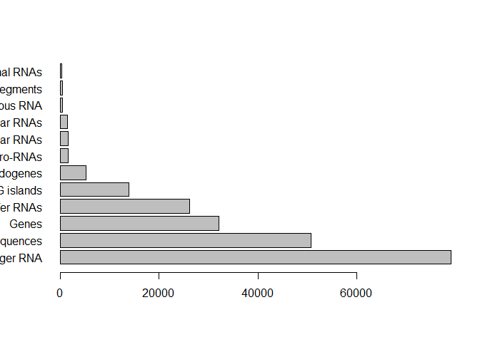
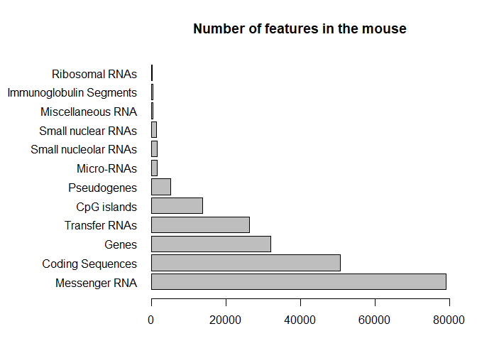
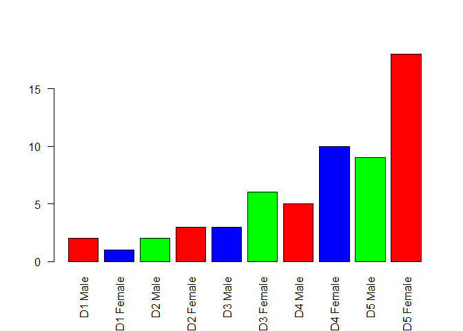
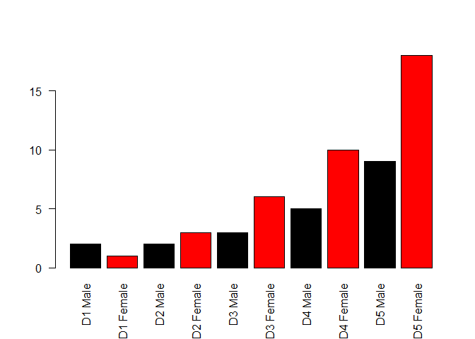

Class 5:Data exploration and visualization in R
================
Han Duong
June 4, 2019

``` r
# 2A. Line plot
weight <- read.table(("bimm143_05_rstats/weight_chart.txt"), header=TRUE)
plot(weight$Age, weight$Weight, typ = "o",
     pch=15, cex=1.5, lwd=2, ylim=c(2,10), 
     xlab="Age (months)", ylab="Weight (kg)",
     main="Baby weight with age")
```


``` r
#2B. Bar Plot
# data, difficult to read, use sep = "\t" to be more readable
mouse <- read.table("bimm143_05_rstats/feature_counts.txt", sep = "\t", header = TRUE)
barplot(mouse$Count, horiz =TRUE, names.arg = mouse$Feature, ylab = "", las =1)
```



``` r
?barplot
```

    ## starting httpd help server ... done

``` r
# (las = 1, found in help barplot/par/las)
par(mar=c(3.1, 11.1, 4.1, 2))
# mar is for the margins, first number bottom up which leaves a certain number of white space)
barplot(mouse$Count, horiz = TRUE, 
        ylab = " ", names.arg = mouse$Feature, 
        main = "Number of features in the mouse", las = 1, 
        xlim = c(0,80000))
```



``` r
#plot example
plot(1:5, pch =1:5, cex =1:5)
```


``` r
#3A Providing color vectors
counts <- read.table("bimm143_05_rstats/male_female_counts.txt", sep = "\t", header =TRUE)

#Could also use the read.delim function
counts <- read.delim("bimm143_05_rstats/male_female_counts.txt")
#specify by color
barplot(counts$Count, names.arg = counts$Sample, las=2,
        col = c("red", "blue", "green"))
```



``` r
#specify by number
barplot(counts$Count, names.arg = counts$Sample, las=2,
        col = c(1,2))
```


