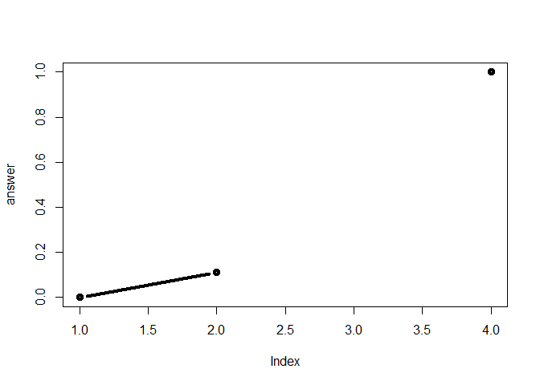

Class 6: R functions
================
Han Duong
April 18, 2019

About
-----

The is my **class 6** R markdown document with my *code* and notes for the day

``` r
plot(1:10, typ = "l", col="blue")
```


Reading in files practice
-------------------------

``` r
read.table("test1.txt", header = TRUE, sep =",")
```

    ##   Col1 Col2 Col3
    ## 1    1    2    3
    ## 2    4    5    6
    ## 3    7    8    9
    ## 4    a    b    c

``` r
read.csv("test1.txt")
```

    ##   Col1 Col2 Col3
    ## 1    1    2    3
    ## 2    4    5    6
    ## 3    7    8    9
    ## 4    a    b    c

``` r
read.table("test2.txt", header =TRUE, sep = "$")
```

    ##   Col1 Col2 Col3
    ## 1    1    2    3
    ## 2    4    5    6
    ## 3    7    8    9
    ## 4    a    b    c

``` r
read.table("test3.txt")
```

    ##   V1 V2 V3
    ## 1  1  6  a
    ## 2  2  7  b
    ## 3  3  8  c
    ## 4  4  9  d
    ## 5  5 10  e

You can read urls.

``` r
read.table("https://bioboot.github.io/bimm143_S19/class-material/test2.txt", header = TRUE, sep = "$")
```

    ##   Col1 Col2 Col3
    ## 1    1    2    3
    ## 2    4    5    6
    ## 3    7    8    9
    ## 4    a    b    c

Functions
---------

Functions have name, arguments (input to function), and a body (where the work gets done).

``` r
add <- function(x, y=1){
  # the body!
  x+y
}
```

You've just created a function which you can now use.

``` r
add(10)
```

    ## [1] 11

You can argue with the default function of y and change it to 10.

``` r
add(10, y=10)
```

    ## [1] 20

Each number of the vector will be added by 1 because y was equal to 1.

``` r
add( c(1,2,3))
```

    ## [1] 2 3 4

Y was originally a number so the function wouldn't work because y is made a string.

add(1, "b")

``` r
x <- c( 1, 10, "string")
is.numeric(x) 
```

    ## [1] FALSE

``` r
range (x, na.rm=TRUE)
```

    ## [1] "1"      "string"

Consider copy and paste errors:
-------------------------------

df*a* &lt; −(*d**f*a - min(df*a*))/(*m**a**x*(*d**f*a) - min(df$a))

df*b* &lt; −(*d**f*b - \*\*min(df*a*)) \* \*/(*m**a**x*(*d**f*b) - min(df$b))

df*c* &lt; −(*d**f*c - min(df*c*))/(*m**a**x*(*d**f*c) - min(df$c))

df*d* &lt; −(*d**f*d - min(df*d*))/\* \* (*m**a**x*(*d**f*a)\*\* - min(df$d))

Writing a function:

-   Makes the purpose of the code more clear

-   Reduce mistakes from copy/paste

-   Makes updating your code easier

-   Reduce duplication and facilitate re-use

You need a “name”, “arguments” and “body”… *na.rm used to omit "NA"*

``` r
rescale <- function(x) {
 rng <-range(x, na.rm = TRUE)
 (x - rng[1]) / (rng[2] - rng[1])
}
# Test on a small example where you know the answer
rescale(1:10)
```

    ##  [1] 0.0000000 0.1111111 0.2222222 0.3333333 0.4444444 0.5555556 0.6666667
    ##  [8] 0.7777778 0.8888889 1.0000000

How would you fix this

``` r
#How would you get your function to work here...
rescale( c(1,2,NA,3,10))
```

    ## [1] 0.0000000 0.1111111        NA 0.2222222 1.0000000

``` r
x <- ( c(1,2,NA,3,10))
 rng <-range(x, na.rm = TRUE)
 rng
```

    ## [1]  1 10

``` r
 (x - rng[1]) / (rng[2] - rng[1])
```

    ## [1] 0.0000000 0.1111111        NA 0.2222222 1.0000000

``` r
rescale2 <- function(x, na.rm=TRUE) {
  
  if(!is.numeric(x)){
    stop("You only can input numbers")
  }
 rng <-range(x, na.rm = na.rm)
 (x - rng[1]) / (rng[2] - rng[1])
}
```

``` r
rescale2(c(1,10))
```

    ## [1] 0 1

``` r
rescale2(c(1,2,NA,3,10))
```

    ## [1] 0.0000000 0.1111111        NA 0.2222222 1.0000000

``` r
rescale3 <- function(x, na.rm=TRUE, plot=FALSE) {
  #each string prints when part of the function is executed
 rng <-range(x, na.rm=na.rm)
 print("Hello")
 
 answer <- (x - rng[1]) / (rng[2] - rng[1])
 
 
 print("is it me you are looking for?")
#if loop, executes only when plot = TRUE
  if(plot) {
     plot(answer, typ="b", lwd=4)
    print("Please don't sing again")
 }
 print("I can see it in ...")
 
 #return statement usually the last statement because any functions following it will be ignored. 
 return(answer)
 # it's not required but recommended because it returns to control to the code that called it
}
```

``` r
rescale3( c(1,2,NA,10))
```

    ## [1] "Hello"
    ## [1] "is it me you are looking for?"
    ## [1] "I can see it in ..."

    ## [1] 0.0000000 0.1111111        NA 1.0000000

Notice it shows only part of it

``` r
rescale3( c(1,2,NA,10), plot =TRUE)
```

    ## [1] "Hello"
    ## [1] "is it me you are looking for?"



    ## [1] "Please don't sing again"
    ## [1] "I can see it in ..."

    ## [1] 0.0000000 0.1111111        NA 1.0000000

Hands On Work
-------------
