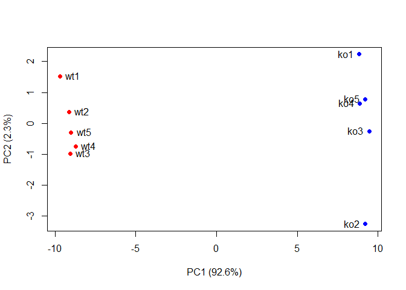

class8: Hands on with PCA
================
Han Duong
April 25, 2019

PCA of UK food data
===================

``` r
 x <- read.csv("UK_foods.csv", row.names=1)
head(x)
```

    ##                England Wales Scotland N.Ireland
    ## Cheese             105   103      103        66
    ## Carcass_meat       245   227      242       267
    ## Other_meat         685   803      750       586
    ## Fish               147   160      122        93
    ## Fats_and_oils      193   235      184       209
    ## Sugars             156   175      147       139

``` r
barplot(as.matrix(x), beside=F, col=rainbow(nrow(x)))
```


``` r
pairs(x, col=rainbow(10), pch=16)
```


``` r
#prcomp expects observations to be rows and variables to be columns
# t() used to transpose function
pca <- prcomp(t(x))
#indicates that 97% of the variance is accounted for by PCA1 and PCA2
summary(pca)
```

    ## Importance of components:
    ##                             PC1      PC2      PC3       PC4
    ## Standard deviation     324.1502 212.7478 73.87622 4.189e-14
    ## Proportion of Variance   0.6744   0.2905  0.03503 0.000e+00
    ## Cumulative Proportion    0.6744   0.9650  1.00000 1.000e+00

``` r
#generate a PC1 vs. PC2 plot
plot(pca$x[,1], pca$x[,2], xlab = "PC1", ylab = "PC2", xlim = c(-270, 500))
text(pca$x[,1], pca$x[,2], colnames(x), col = c("orange", "red", "blue", "green"))
```

 \#Calculate how much variation in the original data each PC accounts for

``` r
v <- round( pca$sdev^2/sum(pca$sdev^2)*100 )
v
```

    ## [1] 67 29  4  0

``` r
# or try
z <- summary(pca)
z$importance
```

    ##                              PC1       PC2      PC3          PC4
    ## Standard deviation     324.15019 212.74780 73.87622 4.188568e-14
    ## Proportion of Variance   0.67444   0.29052  0.03503 0.000000e+00
    ## Cumulative Proportion    0.67444   0.96497  1.00000 1.000000e+00

The information can be summarized in a plot of variance (eigenvalues) with respect to the principal component number (eigenvector number), which is gene below.

``` r
barplot(v, xlab="Principal Component", ylab="Percent Variation")
```


``` r
## Lets focus on PC1 as it accounts for > 90% of variance 
par(mar=c(10, 3, 0.35, 0))
barplot( pca$rotation[,1], las=2 )
```


``` r
## Lets focus on PC2 as it accounts for > 90% of variance 
par(mar=c(10, 3, 0.35, 0))
barplot( pca$rotation[,2], las=2 )
```


Biplots
-------

``` r
##The inbuilt biplot() can be useful for small datasets
biplot(pca)
```


PCA of RNA-seq data
===================

``` r
rna.data <- read.csv("expression.csv", row.names=1)
head(rna.data)
```

    ##        wt1 wt2  wt3  wt4 wt5 ko1 ko2 ko3 ko4 ko5
    ## gene1  439 458  408  429 420  90  88  86  90  93
    ## gene2  219 200  204  210 187 427 423 434 433 426
    ## gene3 1006 989 1030 1017 973 252 237 238 226 210
    ## gene4  783 792  829  856 760 849 856 835 885 894
    ## gene5  181 249  204  244 225 277 305 272 270 279
    ## gene6  460 502  491  491 493 612 594 577 618 638

How many genes and samples are in this data set?

``` r
genes <- nrow(rna.data)
samples <- ncol(rna.data)
genes
```

    ## [1] 100

``` r
samples
```

    ## [1] 10

``` r
## Again we have to take the transpose of our data 
pca <- prcomp(t(rna.data), scale=TRUE)
 
## Simple un ploished plot of pc1 and pc2
plot(pca$x[,1], pca$x[,2])
```


``` r
## Variance captured per PC 
pca.var <- pca$sdev^2

## Precent variance is often more informative to look at 
pca.var.per <- round(pca.var/sum(pca.var)*100, 1)
pca.var.per
```

    ##  [1] 92.6  2.3  1.1  1.1  0.8  0.7  0.6  0.4  0.4  0.0

Scree Plot

``` r
barplot(pca.var.per, main="Scree Plot", 
        xlab="Principal Component", ylab="Percent Variation")
```

 Making it a little more attractive

``` r
## A vector of colors for wt and ko samples
colvec <- colnames(rna.data)
colvec[grep("wt", colvec)] <- "red"
colvec[grep("ko", colvec)] <- "blue"

plot(pca$x[,1], pca$x[,2], col=colvec, pch=16,
     xlab=paste0("PC1 (", pca.var.per[1], "%)"),
     ylab=paste0("PC2 (", pca.var.per[2], "%)"))

text(pca$x[,1], pca$x[,2], labels = colnames(rna.data), pos=c(rep(4,5), rep(2,5)))
```



``` r
## Another way to color by sample type
## Extract the first 2 characters of the sample name
sample.type <- substr(colnames(rna.data),1,2)
sample.type
```

    ##  [1] "wt" "wt" "wt" "wt" "wt" "ko" "ko" "ko" "ko" "ko"

``` r
## now use this as a factor input to color our plot
plot(pca$x[,1], pca$x[,2], col=as.factor(sample.type), pch=16)
```


``` r
loading_scores <- pca$rotation[,1]

## Find the top 10 measurements (genes) that contribute
## most to PC1 in either direction (+ or -)
gene_scores <- abs(loading_scores) 
gene_score_ranked <- sort(gene_scores, decreasing=TRUE)

## show the names of the top 10 genes
top_10_genes <- names(gene_score_ranked[1:10])
top_10_genes 
```

    ##  [1] "gene100" "gene66"  "gene45"  "gene68"  "gene98"  "gene60"  "gene21" 
    ##  [8] "gene56"  "gene10"  "gene90"

``` r
sessionInfo()
```

    ## R version 3.6.0 (2019-04-26)
    ## Platform: x86_64-w64-mingw32/x64 (64-bit)
    ## Running under: Windows 10 x64 (build 17134)
    ## 
    ## Matrix products: default
    ## 
    ## locale:
    ## [1] LC_COLLATE=English_United States.1252 
    ## [2] LC_CTYPE=English_United States.1252   
    ## [3] LC_MONETARY=English_United States.1252
    ## [4] LC_NUMERIC=C                          
    ## [5] LC_TIME=English_United States.1252    
    ## 
    ## attached base packages:
    ## [1] stats     graphics  grDevices utils     datasets  methods   base     
    ## 
    ## loaded via a namespace (and not attached):
    ##  [1] compiler_3.6.0  magrittr_1.5    tools_3.6.0     htmltools_0.3.6
    ##  [5] yaml_2.2.0      Rcpp_1.0.1      stringi_1.4.3   rmarkdown_1.13 
    ##  [9] knitr_1.23      stringr_1.4.0   xfun_0.7        digest_0.6.19  
    ## [13] evaluate_0.14
