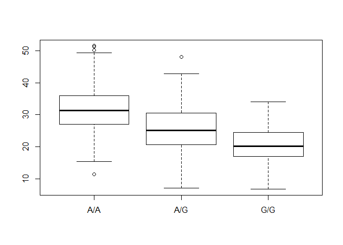

Class13
================
Han Duong
May 14, 2019

Sample genotype in the MXL 1000 Genome project for asthma
---------------------------------------------------------

Here we focus on the Mexican Ancestry in Los Angeles, California (MXL) population.

Main question: Does the GG genotype have an affect on prevalence of asthma of the MXL population?

What proportion of the Mexican Ancestry in LA sample population(MXL) are homozygous fot the asthma associated SNP (G|G) rs8067378

``` r
#Read CSV from ENSEMBLE
mxl <- read.csv("SampleMXL.csv")
head(mxl)
```

    ##   Sample..Male.Female.Unknown. Genotype..forward.strand. Population.s.
    ## 1                  NA19648 (F)                       A|A ALL, AMR, MXL
    ## 2                  NA19649 (M)                       G|G ALL, AMR, MXL
    ## 3                  NA19651 (F)                       A|A ALL, AMR, MXL
    ## 4                  NA19652 (M)                       G|G ALL, AMR, MXL
    ## 5                  NA19654 (F)                       G|G ALL, AMR, MXL
    ## 6                  NA19655 (M)                       A|G ALL, AMR, MXL
    ##   Father Mother
    ## 1      -      -
    ## 2      -      -
    ## 3      -      -
    ## 4      -      -
    ## 5      -      -
    ## 6      -      -

How many of each genotype are there?

``` r
table(mxl$Genotype..forward.strand.)
```

    ## 
    ## A|A A|G G|A G|G 
    ##  22  21  12   9

Proportion or percent of total for each genotype

``` r
(table(mxl$Genotype..forward.strand.) / nrow(mxl)) * 100
```

    ## 
    ##     A|A     A|G     G|A     G|G 
    ## 34.3750 32.8125 18.7500 14.0625

Quality Scores in FASTQ fiels
-----------------------------

The forth line of a FASTQ sequence format file encodes the quality score that tells us how food the sequence at a give position is (i.e. how likely it is to be correct based on the instrument)

``` r
library(seqinr)
library(gtools)
phred <- asc( s2c("DDDDCDEDCDDDDBBDDDCC@") ) - 33
phred
```

    ##  D  D  D  D  C  D  E  D  C  D  D  D  D  B  B  D  D  D  C  C  @ 
    ## 35 35 35 35 34 35 36 35 34 35 35 35 35 33 33 35 35 35 34 34 31

Population Analytics
--------------------

``` r
pop <- read.table("popanalytics.txt")
summary(pop)
```

    ##      sample     geno          exp        
    ##  HG00096:  1   A/A:108   Min.   : 6.675  
    ##  HG00097:  1   A/G:233   1st Qu.:20.004  
    ##  HG00099:  1   G/G:121   Median :25.116  
    ##  HG00100:  1             Mean   :25.640  
    ##  HG00101:  1             3rd Qu.:30.779  
    ##  HG00102:  1             Max.   :51.518  
    ##  (Other):456

``` r
inds <- pop$geno == "G/G"
summary(pop[inds, "exp"])
```

    ##    Min. 1st Qu.  Median    Mean 3rd Qu.    Max. 
    ##   6.675  16.903  20.074  20.594  24.457  33.956

``` r
inds <- pop$geno == "A/G"
summary(pop[inds, "exp"])
```

    ##    Min. 1st Qu.  Median    Mean 3rd Qu.    Max. 
    ##   7.075  20.626  25.065  25.397  30.552  48.034

``` r
inds <- pop$geno == "A/A"
summary(pop[inds, "exp"])
```

    ##    Min. 1st Qu.  Median    Mean 3rd Qu.    Max. 
    ##   11.40   27.02   31.25   31.82   35.92   51.52

``` r
boxplot(exp ~ geno ,data=pop)
```


