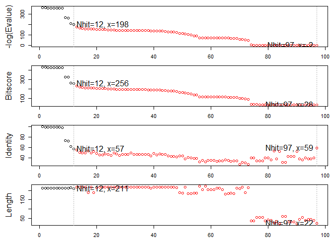
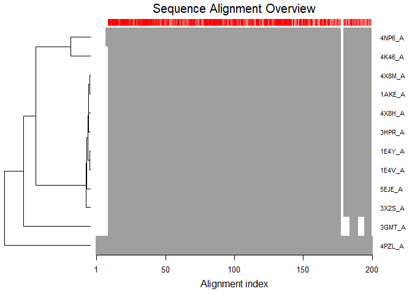

Class11: Structural Bioinformatics
================

The PDB Database
----------------

The [PDB](http://www.rcsb.org/) is the main repository for biomoleculer structure data.

Here we examine the contents of the PDB:

> Q1: Download a CSV file from the PDB site (accessible from “Analyze” -&gt; “PDB Statistics” &gt; “by Experimental Method and Molecular Type”. Move this CSV file into your RStudio project and determine the percentage of structures solved by X-Ray and Electron Microscopy. From the website what proportion of structures are protein? Aim to have a rendered GitHub document with working code that yields your answers

``` r
db <- read.csv("Data Export Summary.csv", row.names=1)
head (db)
```

    ##                     Proteins Nucleic.Acids Protein.NA.Complex Other  Total
    ## X-Ray                 126880          2012               6547     8 135447
    ## NMR                    11062          1279                259     8  12608
    ## Electron Microscopy     2277            31                800     0   3108
    ## Other                    256             4                  6    13    279
    ## Multi Method             129             5                  2     1    137

How many are Xray, etc...?

``` r
(db$Total/sum(db$Total)) * 100
```

    ## [1] 89.35736481  8.31777489  2.05041595  0.18406244  0.09038191

What percent are Protein...

``` r
(sum(db$Proteins)/sum(db$Total)) * 100
```

    ## [1] 92.75955

We could also try the datapasta package and copy from website and go to "Addins &gt; "Pasta as data.frame"...

The name Protein.NAComplex had to be adjusted.

``` r
library(datapasta)

tmp <- data.frame(stringsAsFactors=FALSE,
   Experimental.Method = c("X-Ray", "NMR", "Electron Microscopy", "Other",
                           "Multi Method", "Total"),
              Proteins = c(126880, 11062, 2277, 256, 129, 140604),
         Nucleic.Acids = c(2012, 1279, 31, 4, 5, 3331),
    ProteinComplex = c(6547, 259, 800, 6, 2, 7614),
                 Other = c(8, 8, 0, 13, 1, 30),
                 Total = c(135447, 12608, 3108, 279, 137, 151579)
)
```

> Q2: Type HIV in the PDB website search box on the home page and determine how many HIV-1 protease structures are in the current PDB?

HIV-1 protease structure is 1,157 as of 2019-05-07. Thousands of structural data from the same enzyme and virus. Shows a bit of redundancy. See:<http://www.rcsb.org/pdb/results/results.do?tabtoshow=Current&qrid=5C281786>

\*\*Task Extract separate file for protein only

Extract Drug/Ligand only PDB

> Q6. How many amino acid residues are there in this pdb object and what are the two nonprotein residues?

Calpha indicates how many amino acids there are. The nonprotein residues are HOH(127) and MK1(1).

``` r
library(bio3d)

pdb <- read.pdb("1hsg.pdb")

attributes(pdb)
```

    ## $names
    ## [1] "atom"   "xyz"    "seqres" "helix"  "sheet"  "calpha" "remark" "call"  
    ## 
    ## $class
    ## [1] "pdb" "sse"

``` r
head(pdb$atom)
```

    ##   type eleno elety  alt resid chain resno insert      x      y     z o
    ## 1 ATOM     1     N <NA>   PRO     A     1   <NA> 29.361 39.686 5.862 1
    ## 2 ATOM     2    CA <NA>   PRO     A     1   <NA> 30.307 38.663 5.319 1
    ## 3 ATOM     3     C <NA>   PRO     A     1   <NA> 29.760 38.071 4.022 1
    ## 4 ATOM     4     O <NA>   PRO     A     1   <NA> 28.600 38.302 3.676 1
    ## 5 ATOM     5    CB <NA>   PRO     A     1   <NA> 30.508 37.541 6.342 1
    ## 6 ATOM     6    CG <NA>   PRO     A     1   <NA> 29.296 37.591 7.162 1
    ##       b segid elesy charge
    ## 1 38.10  <NA>     N   <NA>
    ## 2 40.62  <NA>     C   <NA>
    ## 3 42.64  <NA>     C   <NA>
    ## 4 43.40  <NA>     O   <NA>
    ## 5 37.87  <NA>     C   <NA>
    ## 6 38.40  <NA>     C   <NA>

``` r
print(pdb)
```

    ## 
    ##  Call:  read.pdb(file = "1hsg.pdb")
    ## 
    ##    Total Models#: 1
    ##      Total Atoms#: 1686,  XYZs#: 5058  Chains#: 2  (values: A B)
    ## 
    ##      Protein Atoms#: 1514  (residues/Calpha atoms#: 198)
    ##      Nucleic acid Atoms#: 0  (residues/phosphate atoms#: 0)
    ## 
    ##      Non-protein/nucleic Atoms#: 172  (residues: 128)
    ##      Non-protein/nucleic resid values: [ HOH (127), MK1 (1) ]
    ## 
    ##    Protein sequence:
    ##       PQITLWQRPLVTIKIGGQLKEALLDTGADDTVLEEMSLPGRWKPKMIGGIGGFIKVRQYD
    ##       QILIEICGHKAIGTVLVGPTPVNIIGRNLLTQIGCTLNFPQITLWQRPLVTIKIGGQLKE
    ##       ALLDTGADDTVLEEMSLPGRWKPKMIGGIGGFIKVRQYDQILIEICGHKAIGTVLVGPTP
    ##       VNIIGRNLLTQIGCTLNF
    ## 
    ## + attr: atom, xyz, seqres, helix, sheet,
    ##         calpha, remark, call

``` r
# Print a subset of $atom data for the first two atoms
pdb$atom[1:2, c("eleno", "elety", "x","y","z")]
```

    ##   eleno elety      x      y     z
    ## 1     1     N 29.361 39.686 5.862
    ## 2     2    CA 30.307 38.663 5.319

``` r
# Note that individual $atom records can also be accessed like this
pdb$atom$elety[1:2]
```

    ## [1] "N"  "CA"

``` r
# Which allows us to do the following
plot.bio3d(pdb$atom$b[pdb$calpha], sse=pdb, typ="l", ylab="B-factor")
```


> Q7. What type of R object is pdb$atom? HINT: You can always use the str() function to get a useful summery of any R object.

As you can see, it is a data.frame.

``` r
str(pdb$atom)
```

    ## 'data.frame':    1686 obs. of  16 variables:
    ##  $ type  : chr  "ATOM" "ATOM" "ATOM" "ATOM" ...
    ##  $ eleno : int  1 2 3 4 5 6 7 8 9 10 ...
    ##  $ elety : chr  "N" "CA" "C" "O" ...
    ##  $ alt   : chr  NA NA NA NA ...
    ##  $ resid : chr  "PRO" "PRO" "PRO" "PRO" ...
    ##  $ chain : chr  "A" "A" "A" "A" ...
    ##  $ resno : int  1 1 1 1 1 1 1 2 2 2 ...
    ##  $ insert: chr  NA NA NA NA ...
    ##  $ x     : num  29.4 30.3 29.8 28.6 30.5 ...
    ##  $ y     : num  39.7 38.7 38.1 38.3 37.5 ...
    ##  $ z     : num  5.86 5.32 4.02 3.68 6.34 ...
    ##  $ o     : num  1 1 1 1 1 1 1 1 1 1 ...
    ##  $ b     : num  38.1 40.6 42.6 43.4 37.9 ...
    ##  $ segid : chr  NA NA NA NA ...
    ##  $ elesy : chr  "N" "C" "C" "O" ...
    ##  $ charge: chr  NA NA NA NA ...

``` r
# Print a summary of the coordinate data in $xyz
pdb$xyz
```

    ## 
    ##    Total Frames#: 1
    ##    Total XYZs#:   5058,  (Atoms#:  1686)
    ## 
    ##     [1]  29.361  39.686  5.862  <...>  30.112  17.912  -4.791  [5058] 
    ## 
    ## + attr: Matrix DIM = 1 x 5058

``` r
# Examine the row and column dimensions
dim(pdb$xyz)
```

    ## [1]    1 5058

``` r
# Print coordinates for the first two atom
pdb$xyz[ 1, atom2xyz(1:2) ]
```

    ## [1] 29.361 39.686  5.862 30.307 38.663  5.319

Atom selection is done via the function **atom.select()**

``` r
# Select chain A
a.inds <- atom.select(pdb, chain="A")
# Select C-alphas of chain A
ca.inds <- atom.select(pdb, "calpha", chain="A")
# We can combine multiple selection criteria to return their intersection
cab.inds <- atom.select(pdb, elety=c("CA","CB"), chain="A",
resno=10:20)
```

The XYZ indices \# is triple the atom indices. Three coordinates of XYZ for every one of these atoms.

``` r
#select protein only
prot.pdb <- atom.select(pdb, 'protein', value = TRUE)
write.pdb(prot.pdb, file = "1hsg_protein.pdb")
```

> Q8. Use the Bio3D write.pdb() function to write out a protein only PDB file for viewing in VMD. Also write out a second separate PDB file for the ligand with residue name MK1 HINT: In Bio3D you can use the trim.pdb() function together with the pub object and your atom selections such as atom.select(pdb, ’protein’) for the fist file and atom.select(pdb, ‘ligand’) for the second.

``` r
lig.pdb <- atom.select(pdb, "ligand", value = TRUE)
write.pdb(lig.pdb, file = "1hsg_ligand.pdb")
```

Section 5: Example Application on Adenylate Kinase

``` r
aa <- get.seq("1ake_A")
```

    ## Warning in get.seq("1ake_A"): Removing existing file: seqs.fasta

``` r
# Blast or hmmer search
b <- blast.pdb(aa)
```

    ##  Searching ... please wait (updates every 5 seconds) RID = FG5X4Y9J014 
    ##  .
    ##  Reporting 97 hits

``` r
# Plot a summary of search results
hits <- plot(b)
```

    ##   * Possible cutoff values:    197 -3 
    ##             Yielding Nhits:    12 97 
    ## 
    ##   * Chosen cutoff value of:    197 
    ##             Yielding Nhits:    12



``` r
head(hits$pdb.id)
```

    ## [1] "1AKE_A" "4X8M_A" "4X8H_A" "3HPR_A" "1E4V_A" "5EJE_A"

HWK: vmd - hsg section 1 and 2

``` r
# Fetch PDBs
files <- get.pdb(hits$pdb.id, path="pdbs", split=TRUE, gzip=TRUE)
```

    ## Warning in get.pdb(hits$pdb.id, path = "pdbs", split = TRUE, gzip = TRUE):
    ## pdbs/1AKE.pdb exists. Skipping download

    ## Warning in get.pdb(hits$pdb.id, path = "pdbs", split = TRUE, gzip = TRUE):
    ## pdbs/4X8M.pdb exists. Skipping download

    ## Warning in get.pdb(hits$pdb.id, path = "pdbs", split = TRUE, gzip = TRUE):
    ## pdbs/4X8H.pdb exists. Skipping download

    ## Warning in get.pdb(hits$pdb.id, path = "pdbs", split = TRUE, gzip = TRUE):
    ## pdbs/3HPR.pdb exists. Skipping download

    ## Warning in get.pdb(hits$pdb.id, path = "pdbs", split = TRUE, gzip = TRUE):
    ## pdbs/1E4V.pdb exists. Skipping download

    ## Warning in get.pdb(hits$pdb.id, path = "pdbs", split = TRUE, gzip = TRUE):
    ## pdbs/5EJE.pdb exists. Skipping download

    ## Warning in get.pdb(hits$pdb.id, path = "pdbs", split = TRUE, gzip = TRUE):
    ## pdbs/1E4Y.pdb exists. Skipping download

    ## Warning in get.pdb(hits$pdb.id, path = "pdbs", split = TRUE, gzip = TRUE):
    ## pdbs/3X2S.pdb exists. Skipping download

    ## Warning in get.pdb(hits$pdb.id, path = "pdbs", split = TRUE, gzip = TRUE):
    ## pdbs/4K46.pdb exists. Skipping download

    ## Warning in get.pdb(hits$pdb.id, path = "pdbs", split = TRUE, gzip = TRUE):
    ## pdbs/4NP6.pdb exists. Skipping download

    ## Warning in get.pdb(hits$pdb.id, path = "pdbs", split = TRUE, gzip = TRUE):
    ## pdbs/3GMT.pdb exists. Skipping download

    ## Warning in get.pdb(hits$pdb.id, path = "pdbs", split = TRUE, gzip = TRUE):
    ## pdbs/4PZL.pdb exists. Skipping download

    ## 
      |                                                                       
      |                                                                 |   0%
      |                                                                       
      |=====                                                            |   8%
      |                                                                       
      |===========                                                      |  17%
      |                                                                       
      |================                                                 |  25%
      |                                                                       
      |======================                                           |  33%
      |                                                                       
      |===========================                                      |  42%
      |                                                                       
      |================================                                 |  50%
      |                                                                       
      |======================================                           |  58%
      |                                                                       
      |===========================================                      |  67%
      |                                                                       
      |=================================================                |  75%
      |                                                                       
      |======================================================           |  83%
      |                                                                       
      |============================================================     |  92%
      |                                                                       
      |=================================================================| 100%

``` r
# Align structures
pdbs <- pdbaln(files)
```

    ## Reading PDB files:
    ## pdbs/split_chain/1AKE_A.pdb
    ## pdbs/split_chain/4X8M_A.pdb
    ## pdbs/split_chain/4X8H_A.pdb
    ## pdbs/split_chain/3HPR_A.pdb
    ## pdbs/split_chain/1E4V_A.pdb
    ## pdbs/split_chain/5EJE_A.pdb
    ## pdbs/split_chain/1E4Y_A.pdb
    ## pdbs/split_chain/3X2S_A.pdb
    ## pdbs/split_chain/4K46_A.pdb
    ## pdbs/split_chain/4NP6_A.pdb
    ## pdbs/split_chain/3GMT_A.pdb
    ## pdbs/split_chain/4PZL_A.pdb
    ##    PDB has ALT records, taking A only, rm.alt=TRUE
    ## ...   PDB has ALT records, taking A only, rm.alt=TRUE
    ## ..   PDB has ALT records, taking A only, rm.alt=TRUE
    ## ...   PDB has ALT records, taking A only, rm.alt=TRUE
    ## ....
    ## 
    ## Extracting sequences
    ## 
    ## pdb/seq: 1   name: pdbs/split_chain/1AKE_A.pdb 
    ##    PDB has ALT records, taking A only, rm.alt=TRUE
    ## pdb/seq: 2   name: pdbs/split_chain/4X8M_A.pdb 
    ## pdb/seq: 3   name: pdbs/split_chain/4X8H_A.pdb 
    ## pdb/seq: 4   name: pdbs/split_chain/3HPR_A.pdb 
    ##    PDB has ALT records, taking A only, rm.alt=TRUE
    ## pdb/seq: 5   name: pdbs/split_chain/1E4V_A.pdb 
    ## pdb/seq: 6   name: pdbs/split_chain/5EJE_A.pdb 
    ##    PDB has ALT records, taking A only, rm.alt=TRUE
    ## pdb/seq: 7   name: pdbs/split_chain/1E4Y_A.pdb 
    ## pdb/seq: 8   name: pdbs/split_chain/3X2S_A.pdb 
    ## pdb/seq: 9   name: pdbs/split_chain/4K46_A.pdb 
    ##    PDB has ALT records, taking A only, rm.alt=TRUE
    ## pdb/seq: 10   name: pdbs/split_chain/4NP6_A.pdb 
    ## pdb/seq: 11   name: pdbs/split_chain/3GMT_A.pdb 
    ## pdb/seq: 12   name: pdbs/split_chain/4PZL_A.pdb

``` r
# Vector containing PDB codes
ids <- basename.pdb(pdbs$id)
# Draw schematic alignment
plot(pdbs, labels=ids)
```



``` r
cons <- conserv(pdbs, method="entropy22")
# SSE annotations
sse <- pdbs2sse(pdbs, ind=1, rm.gaps=FALSE)
```

    ## Extracting SSE from pdbs$sse attribute

``` r
# Plot conservation per residue
plotb3(cons, sse=sse, ylab="Sequence entropy")
```


``` r
anno <- pdb.annotate(ids)
```

    ## Warning in pdb.annotate(ids): ids should be standard 4 character PDB-IDs:
    ## trying first 4 characters...

``` r
print(unique(anno$source))
```

    ## [1] "Escherichia coli"          "Photobacterium profundum" 
    ## [3] "Vibrio cholerae"           "Burkholderia pseudomallei"
    ## [5] "Francisella tularensis"
